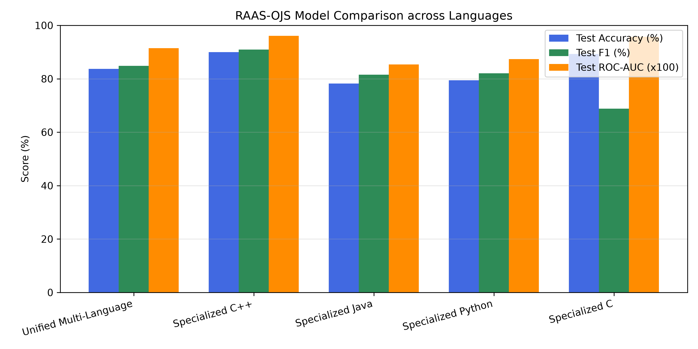

# RAAS-OJS Model Training Pipeline

This directory contains the dataset extraction, GPU-accelerated XGBoost training, threshold optimization, and Treelite export pipeline for the predictive resource-tier classification layer in **RAAS-OJS**.

---

## 1. Pipeline Overview

```text
[Dataset 1: IBM Project CodeNet]  OR  [Dataset 2: DeepMind CodeContests]
       │                                     │
       ▼ [extract_dataset.py]                ▼ [extract_codecontests.py]
Sampled Dataset Directory (subset/) + Manifest CSV (sample_manifest.csv)
       │
       ▼ [feature-extraction-pipeline] (Rust Tree-sitter Extractor)
features.csv (26 AST & Structural Complexity Metrics)
       │
       ▼ [train_advanced_xgboost.py] (5-Fold GroupKFold on Unseen Problems)
artifacts/  →  model_*.joblib  ·  model_*.json  ·  treelite_*.checkpoint
       │
       ▼ [regenerate_models.sh] (m2cgen — compile XGBoost → Rust)
server/src/generated/*.rs  ← compiled into the judge binary
```

**The whole chain feeds the judge:** the server never loads a model file at runtime —
`regenerate_models.sh` compiles the trained `.joblib` models into Rust source that
`cargo build` bakes straight into the `server` binary.

---

## 2. Prerequisites & Environment Setup

1. **Python $\ge$ 3.10** with `uv` or `pip`:
   ```bash
   cd model-training
   uv venv --python 3.11 .venv
   source .venv/bin/activate
   uv pip install -r requirements.txt
   ```
2. **NVIDIA GPU with CUDA** (recommended for acceleration, CPU fallback automatically supported).
3. **Compiled Rust Feature Extractor**:
   ```bash
   cd ../feature-extraction-pipeline
   cargo build --release --bin OJ-feature-extraction-spike
   cd ../model-training
   ```

---

## 3. Step-by-Step Execution Guides

### Option A: Training on IBM Project CodeNet (Real Server Execution Logs)
> **Prerequisite:** Set `--codenet-root` to where the IBM Project CodeNet dataset is mounted on your machine.

```bash
# Step 1: Extract 71,218 stratified submissions across C, C++, Java, and Python
python3 extract_dataset.py \
    --codenet-root "/path/to/Project_CodeNet" \
    --output-dir "./codenet_subset" \
    --manifest "./sample_manifest.csv" \
    --per-stratum 10000 \
    --workers 64

# Step 2: Extract 26 AST features in Rust (< 15 seconds)
../feature-extraction-pipeline/target/release/OJ-feature-extraction-spike \
    ./codenet_subset \
    ./features.csv

# Step 3: Train XGBoost models & export Treelite checkpoints
python3 train_advanced_xgboost.py \
    --features-csv "./features.csv" \
    --manifest-csv "./sample_manifest.csv" \
    --output-dir "./artifacts"

# Step 4: Compile the trained models into Rust for the judge (m2cgen)
./regenerate_models.sh
# then rebuild the judge so the new weights are baked in:
cd ../server && cargo build && cd ../model-training
```

> **Working directory note:** Steps 1–3 run from `model-training/`. Step 4 runs
> `regenerate_models.sh` from `model-training/` too — it writes
> `server/src/generated/*.rs` automatically.

---

### Option B: Training on DeepMind CodeContests (Modern Algorithmic Benchmark)
Streams directly from HuggingFace (`deepmind/code_contests` - Codeforces, CodeChef, HackerEarth) with no external drive required.

```bash
# Step 1: Stream and extract balanced submissions (5,000 per stratum - empirical sweet spot)
python3 extract_codecontests.py \
    --output-dir "./codecontests_subset" \
    --manifest "./sample_manifest_codecontests.csv" \
    --per-stratum 5000

# Step 2: Extract 26 AST features in Rust (< 10 seconds)
../feature-extraction-pipeline/target/release/OJ-feature-extraction-spike \
    ./codecontests_subset \
    ./features_codecontests.csv

# Step 3: Train XGBoost models & export Treelite checkpoints
python3 train_advanced_xgboost.py \
    --features-csv "./features_codecontests.csv" \
    --manifest-csv "./sample_manifest_codecontests.csv" \
    --output-dir "./artifacts"

# Step 4: Compile the trained models into Rust for the judge (m2cgen)
./regenerate_models.sh
# then rebuild the judge so the new weights are baked in:
cd ../server && cargo build && cd ../model-training
```

> **Working directory note:** Steps 1–3 run from `model-training/`. Step 4 runs
> `regenerate_models.sh` from `model-training/` too — it writes
> `server/src/generated/*.rs` automatically. Both Option A and Option B write
> into the **same** `./artifacts/` and `server/src/generated/`, so retraining on
> a different dataset simply overwrites the models the judge uses.

---

## 4. Benchmark Performance on Unseen Problems

### IBM Project CodeNet (71,218 Submissions with Real Hardware Timings)
| Model Architecture | 5-Fold CV Accuracy | Test Accuracy (Unseen Problems) | F1-Score | Precision | Recall | ROC-AUC | Optimal Threshold |
|---|---|---|---|---|---|---|---|
| **Specialized C++ Model** | $87.32\%$ | **$90.01\%$** *(std: 90.01%)* | **$90.91\%$** | $88.54\%$ | $93.41\%$ | **$0.9612$** | $0.439$ |
| **Specialized C Model** | $89.27\%$ | **$89.26\%$** *(std: 91.95%)* | **$68.82\%$** | $55.98\%$ | $89.31\%$ | **$0.9575$** | $0.200$ |
| **Specialized Python Model** | $76.97\%$ | **$79.45\%$** *(std: 79.13%)* | **$82.01\%$** | $80.33\%$ | $83.76\%$ | **$0.8740$** | $0.456$ |
| **Specialized Java Model** | $79.30\%$ | **$78.20\%$** *(std: 77.52%)* | **$81.54\%$** | $82.03\%$ | $81.06\%$ | **$0.8537$** | $0.482$ |
| **Unified Multi-Language Model** | $82.19\%$ | **$83.71\%$** *(std: 83.76%)* | **$84.81\%$** | $80.19\%$ | $89.99\%$ | **$0.9149$** | $0.457$ |

### DeepMind CodeContests (30,000 Submissions - 5,000 Sweet Spot Strata)
| Model Architecture | 5-Fold CV Accuracy | Test Accuracy (Unseen Problems) | F1-Score | Precision | Recall | ROC-AUC | Optimal Threshold |
|---|---|---|---|---|---|---|---|
| **Unified Multi-Language Model** | $86.74\%$ | **$86.78\%$** *(std: 88.01%)* | **$89.64\%$** | $82.74\%$ | $97.79\%$ | **$0.9606$** | $0.231$ |
| **Specialized Python Model** | $95.76\%$ | **$98.88\%$** *(std: 98.32%)* | **$99.41\%$** | $98.82\%$ | $100.0\%$ | **$0.9812$** | $0.100$ |
| **Specialized C++ Model** | $84.27\%$ | **$83.94\%$** *(std: 85.92%)* | **$87.49\%$** | $78.67\%$ | $98.53\%$ | **$0.9474$** | $0.100$ |
| **Specialized Java Model** | $79.43\%$ | **$82.32\%$** *(std: 84.60%)* | **$83.28\%$** | $73.09\%$ | $96.76\%$ | **$0.9430$** | $0.200$ |



---

## 5. Exported Model Artifacts

The output directory `./artifacts/` will contain:
- **`model_*.joblib`**: Pickled XGBoost models — **this is what `regenerate_models.sh` reads** to produce the Rust code for the judge.
- **`model_*.json`**: Native XGBoost model representations.
- **`treelite_*.checkpoint`**: Standalone compiled decision trees for sub-microsecond, pure C/Rust runtime inference (no Python interpreter needed in the judging engine hot path).
- **`model_comparison.csv` / `.png`**: Evaluation metrics and cross-language performance visualizations.

Step 4 (`regenerate_models.sh`) additionally writes **`server/src/generated/*.rs`** —
the XGBoost models compiled to Rust via `m2cgen` that `cargo build` bakes into the judge.

> **`regenerate_models.sh` needs `m2cgen` + `joblib`** installed in a Python venv at
> `model-training/.venv` (see §2). It also handles the XGBoost 3.x `base_score=None`
> quirk that otherwise breaks `m2cgen`.
